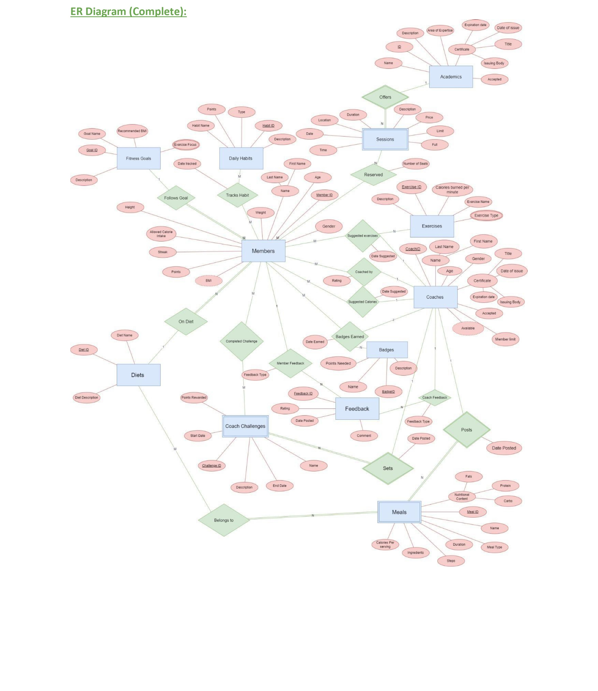
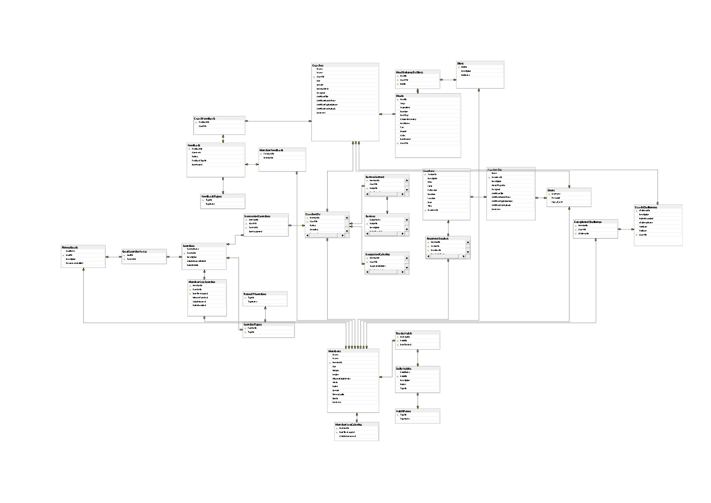
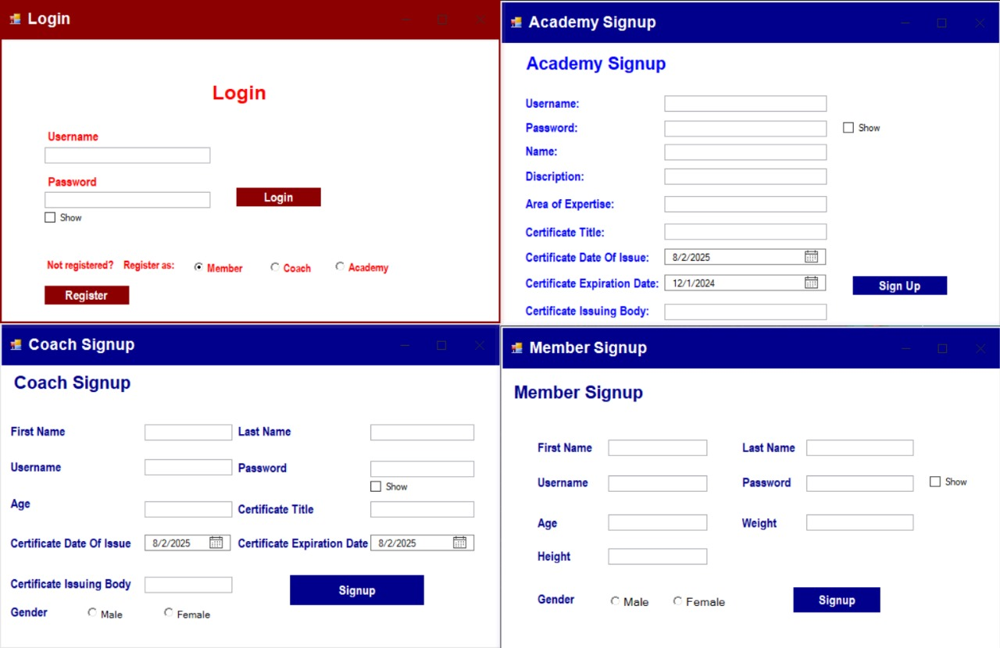
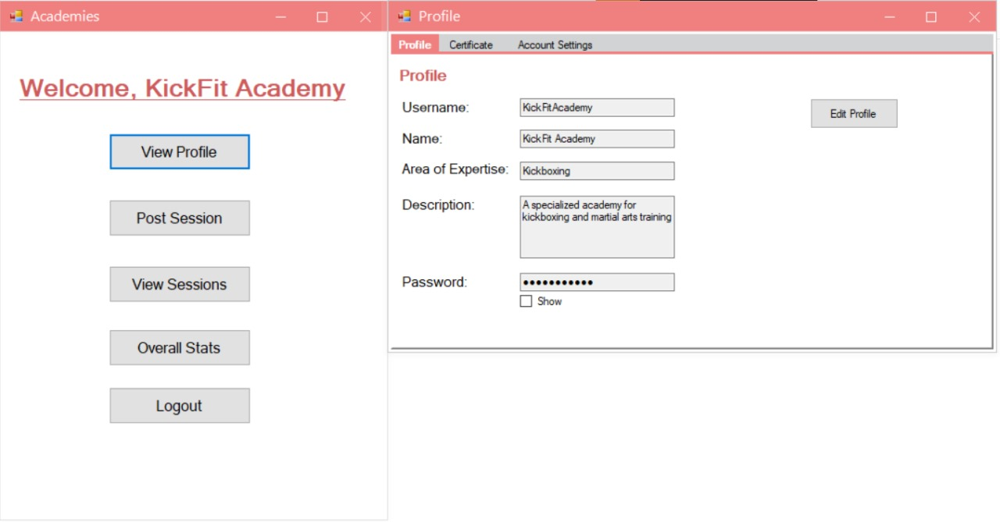
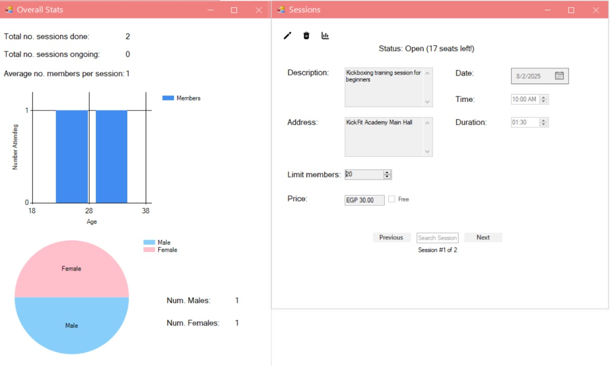
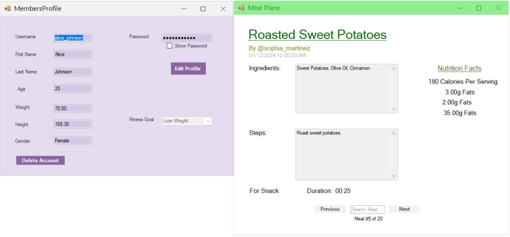
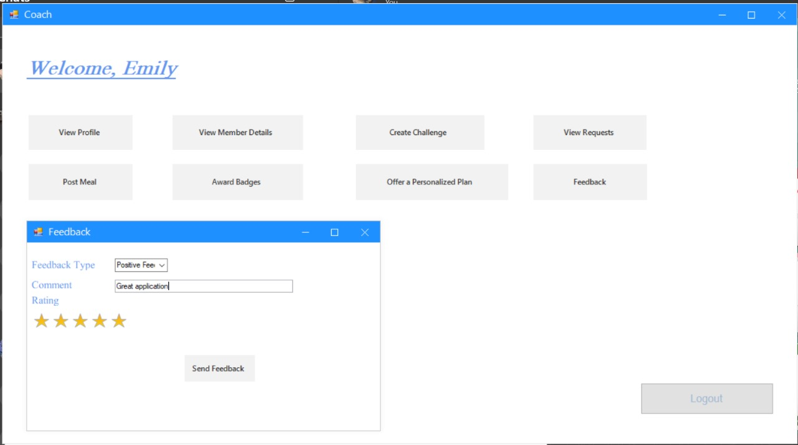
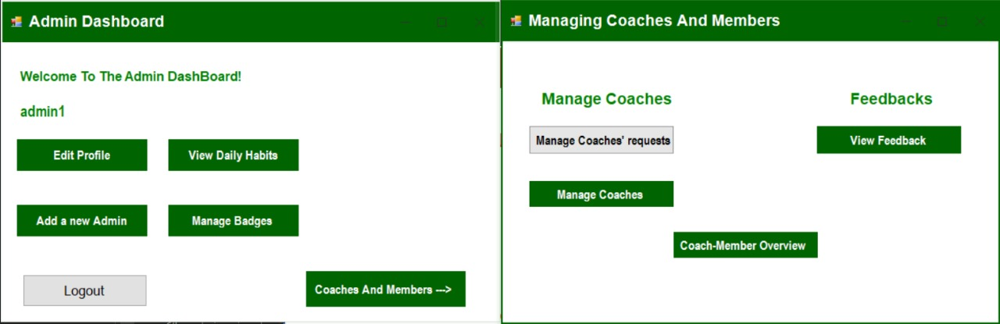

<a id="readme-top"></a>
[](https://www.linkedin.com/in/ibrahim-hesham-abdel-dayem/)

<!-- PROJECT LOGO -->
<br />
<div align="center">
  <a href="https://github.com/ibraaahim11/Fitness-Application">
    
  </a>

<h3 align="center">Fitness Application</h3>
</div>

<!-- TABLE OF CONTENTS -->
<details>
  <summary>Table of Contents</summary>
  <ol>
    <li>
      <a href="#about-the-project">About The Project</a>
      <ul>
        <li><a href="#built-with">Built With</a></li>
      </ul>
    </li>
    <li><a href="#getting-started">Getting Started</a></li>
    <li><a href="#usage">Usage</a></li>
    <li><a href="#preview">Preview</a></li>
    <li><a href="#prerequisites">Prerequisites</a></li>
    <li><a href="#installation">Installation</a></li>
    <li><a href="#license">License</a></li>
  </ol>
</details>

<!-- ABOUT THE PROJECT -->

## <a id="about-the-project"></a>About The Project

Are you a fitness enthusiast looking for more than just a calorie tracker? This Fitness Application is built for people who want to take control of their health, connect with expert coaches for truly personalized plans, and discover exciting fitness events and places—all in one platform. I realized that most people need an app to track their calories and eating habits, a platform to connect with coaches for personalized plans, and a social space to discover cool fitness places (academies). This project combines all those essential tools and technologies into a single, seamless experience to motivate, connect, and empower users on every step of their fitness journey.


## Database Diagrams

The entity-relationship & relational-schema diagrams for this project are quite intricate and comprehensive, reflecting the many features and relationships in the system. They are worth looking at if you would like to understand the system more as I am pretty proud of them.

## Entity Relationship Diagram

<p align="center">
  
</p>

## Relational Schema Diagram

<p align="center">
  
</p>

<p align="right">(<a href="#readme-top">back to top</a>)</p>

## <a id="built-with"></a>🛠️ Built With

[](https://docs.microsoft.com/en-us/dotnet/csharp/)
[](https://en.wikipedia.org/wiki/SQL)
[](https://www.microsoft.com/en-us/sql-server)
[](https://learn.microsoft.com/en-us/dotnet/desktop/winforms/)

<p align="right">(<a href="#readme-top">back to top</a>)</p>

<!-- GETTING STARTED -->

## <a id="getting-started"></a>Getting Started

Follow these steps so you can run the Fitness Application locally.

<!-- USAGE EXAMPLES -->

## <a id="usage"></a>📖 Usage

1. **For Members**

   - Sign up or log in to your account.
   - Edit your profile and update personal information.
   - Choose a fitness goal (Lose weight, Maintain weight, Gain muscle).
   - Log exercises and calorie intake daily to track your progress.
   - Track and update daily habits for a healthier lifestyle.
   - Connect with professional coaches, request personalized workout and diet plans, and rate your experience.
   - Join challenges posted by coaches to earn points and badges.
   - View your streaks, rankings, and earned badges for extra motivation.
   - Browse meal plans tailored to your dietary preferences.
   - Discover academies (gyms, yoga studios, and more) in your area, view their events, and reserve seats for yourself and friends.
   - Be part of a fitness community—explore, participate, and grow.

2. **For Coaches**

   - Sign up or log in to your account.
   - Accept or decline member training requests.
   - View and manage assigned trainees' data and progress.
   - Create and assign personalized workout and diet plans.
   - Post challenges and meal plans for members.
   - Award badges and provide feedback to members.

3. **For Academies**

   - Sign up or log in to your account.
   - Provide your area of expertise, location, and description.
   - Post events with details (location, time, number of seats).
   - View reservations and attendee lists for your events.
   - Access statistics on attendees (gender, age, and event effectiveness).

4. **For Admins**
   - Approve or reject coach applications and manage coaches.
   - Monitor coach, member, and academy statistics and rankings.
   - Set limits on member count per coach.
   - Manage badges and review feedback from users.

This app is your all-in-one fitness companion.

---

### <a id="preview"></a>🖼️ Preview
> **Note:** The UI was developed by multiple contributors, so it may not be visually uniform throughout the application. The main focus was on delivering robust functionality.

#### Login & Signup

- Choose to log in or sign up as a member, coach, academy, or admin.



#### Academy Dashboard & Profile

- Academies can manage their profile, expertise, and certificate.



#### Academy Sessions & Stats

- View, create, and manage sessions/events. See attendee stats (gender, age, etc.).



#### Member Features

- Some Member features



#### Coach Features

- Some Coach features



#### Admin Dashboard

- Admins can monitor statistics, manage users, and review feedback.



<p align="right">(<a href="#readme-top">back to top</a>)</p>

## <a id="prerequisites"></a>Prerequisites

Before running this project, make sure you have the following installed on your machine:

- [Visual Studio](https://visualstudio.microsoft.com/) (Community Edition or higher, recommended for C# development)
- [.NET Desktop Runtime](https://dotnet.microsoft.com/en-us/download/dotnet) (for running C# Windows Forms/WPF applications)
- [Microsoft SQL Server](https://www.microsoft.com/en-us/sql-server) (for the database)
- [SQL Server Management Studio (SSMS)](https://aka.ms/ssms) (optional, for managing the database)
- [Git](https://git-scm.com/) (for cloning the repository)

To verify installation:

```bash
git --version
```

```bash
dotnet --version
```

### <a id="installation"></a>Installation

1. **Clone the repository**

   ```sh
   git clone https://github.com/ibraaahim11/Fitness-Application.git
   ```

2. **Set up the Database**

   - Open **Microsoft SQL Server Management Studio (SSMS)**.
   - Connect to your SQL Server instance.
   - Open the file `documents/FitnessApplication.sql` from this repository.
   - Execute the script to create and populate the database.

3. **Configure the Database Connection**

   - In Visual Studio, open the solution (`FitnessApplication.sln`).
   - Locate your application's database connection string (usually in `App.config` or `Settings.settings`).
   - Update the connection string to match your SQL Server instance (server name, database name, authentication, etc.).
   - To check or edit the connection string:
     - Right-click the project in Solution Explorer → **Properties** → **Settings** or open `App.config`.
     - Make sure the connection string points to the database you just created.

4. **Build and Run the Application**

   - In Visual Studio, double-click `FitnessApplication.sln` to open the solution.
   - Press `F5` or click the "Start" button to build and run the project.

<p align="right">(<a href="#readme-top">back to top</a>)</p>

## 🔑 Demo Users

You can log in with any of the following demo accounts (all use password `password123`):

| Username              | User Type |
| --------------------- | --------- |
| admin1                | admin     |
| alice_johnson         | member    |
| bob_smith             | member    |
| tina_harris           | member    |
| alexander_lewis       | coach     |
| charlotte_clark       | coach     |
| emily_johnson         | coach     |
| BeachFitAcademy       | academy   |
| CrossFitNationAcademy | academy   |
| YogaFlowAcademy       | academy   |

<p align="right">(<a href="#readme-top">back to top</a>)</p>

## <a id="license"></a>License

This project is intended for educational purposes only and is not licensed for commercial use or redistribution.

<p align="right">(<a href="#readme-top">back to top</a>)</p>
